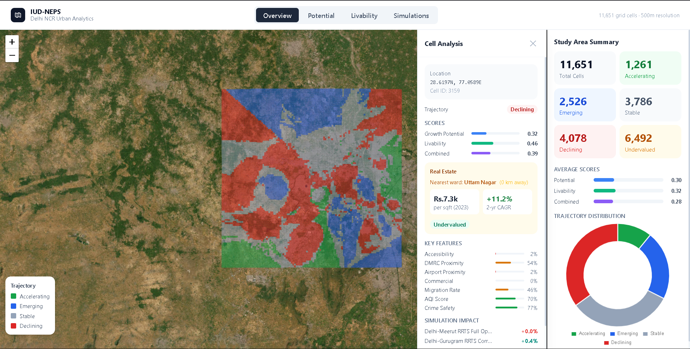
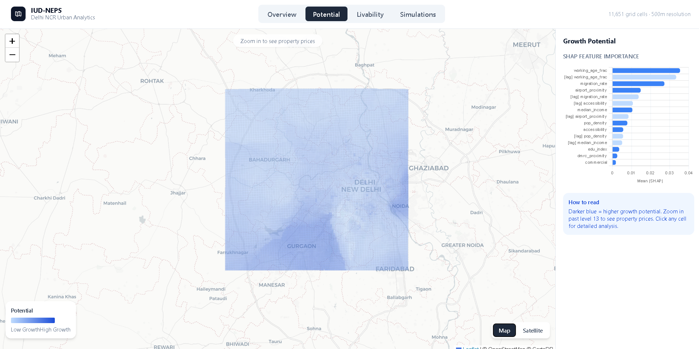
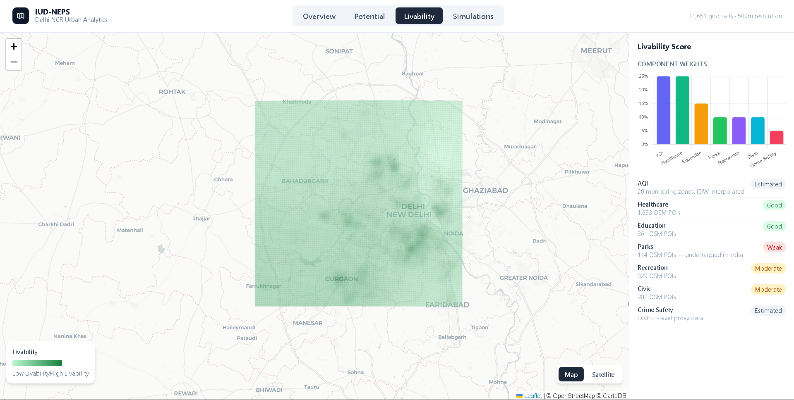
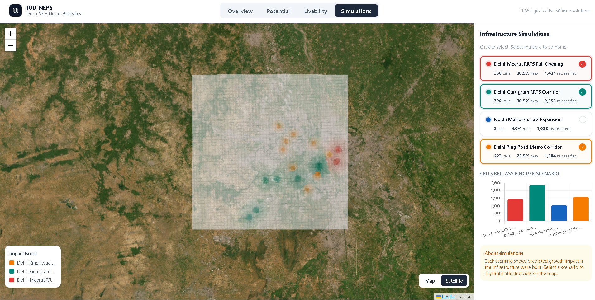

# IUD-NEPS
### Integrated Urban Dynamics and Neighbourhood Evolution Prediction System

A spatially explicit, multi-layer machine learning framework for neighbourhood growth prediction and livability analysis across Delhi NCR — built entirely on real geospatial data.


*Overview tab — trajectory map with cell-level analysis panel*

---

## What This Does

IUD-NEPS scores every 500m × 500m cell across 2,913 km² of Delhi NCR on two dimensions:

- **Growth Potential** — where property values and economic activity are likely to increase, predicted by an XGBoost + LightGBM ensemble (R² = 0.85)
- **Livability** — where it's actually good to live, based on air quality, healthcare, parks, safety, and civic amenities

It then classifies each cell into one of four trajectories — **Accelerating**, **Emerging**, **Stable**, or **Declining** — and simulates the impact of proposed infrastructure like new metro lines and RRTS corridors.

---

## Tech Stack

- Python, GeoPandas, OSMnx, Rasterio
- XGBoost, LightGBM, SHAP
- Leaflet.js, Chart.js
- Spatial indexing + GeoJSON pipelines
- OpenStreetMap + Census + AQI datasets

## Dashboard

### Growth Potential

*Growth potential heatmap — zoom in past level 13 to see ward-level property prices. Click any cell for detailed score breakdown.*

### Livability

*Livability score — weighted composite of AQI, healthcare, education, parks, recreation, civic amenities and crime proxy.*

### Infrastructure Simulations

*Multi-select infrastructure scenarios — combine multiple corridors to see cumulative impact across the city.*

---

## Results

| Model | R² | RMSE |
|-------|----|------|
| Ridge Regression | 0.77 | 0.079 |
| Random Forest | 0.81 | 0.072 |
| XGBoost | 0.85 | 0.063 |
| LightGBM | 0.85 | 0.064 |
| **Ensemble (XGB + LGBM)** | **0.85** | **0.063** |

Top SHAP features: working age fraction, migration rate, airport proximity, accessibility to economic centres.

---

## Data Sources

| Data | Source | Type |
|------|--------|------|
| Road network + POIs | OpenStreetMap (Geofabrik) | Downloaded |
| DMRC metro stations | OpenStreetMap | Downloaded |
| Property prices | DDA / public ward records | Seeded CSV |
| Census demographics | Census of India 2011 | Seeded CSV |
| Air quality (AQI) | CPCB monitoring stations | Seeded CSV |
| Crime proxy | Delhi Police / NCRB 2022 | Seeded CSV |

---

## Setup

### Requirements
- Python 3.12
- ~500 MB disk space for OSM data

### Installation

```bash
git clone https://github.com/yourusername/iud-neps
cd iud-neps
py -3.12 -m venv venv
venv\Scripts\activate        # Windows
# source venv/bin/activate   # Mac/Linux
py -3.12 -m pip install -r requirements.txt
```

### Data Download

Download the OSM extract for North India from Geofabrik:

```
https://download.geofabrik.de/asia/india/northern-zone-latest.osm.pbf
```

Place it in `data/raw/`.

---

## Running the Pipeline

Run each script in order from the project root:

```bash
# Step 2 — Extract POIs and seed CSV data
py -3.12 scripts/fetch_data.py

# Step 3 — Build grid and compute all features
py -3.12 scripts/feature_engineering.py

# Step 4 — Train XGBoost + LightGBM ensemble
py -3.12 scripts/train_models.py

# Step 5 — Classify cells into trajectories
py -3.12 scripts/classify.py

# Step 6 — Run infrastructure scenario simulations
py -3.12 scripts/simulate.py

# Step 7 — Generate interactive dashboard
py -3.12 scripts/dashboard.py
```

The dashboard opens automatically in your browser and is saved to `outputs/dashboard.html`.

---

## Project Structure

```
iud-neps/
├── config.py                    # All settings — edit here to change anything
├── requirements.txt
├── .gitignore
│
├── scripts/
│   ├── fetch_data.py            # Step 2: data collection
│   ├── feature_engineering.py  # Step 3: 28 spatial features
│   ├── train_models.py          # Step 4: model training + SHAP
│   ├── classify.py              # Step 5: trajectory classification
│   ├── simulate.py              # Step 6: scenario simulation
│   └── dashboard.py             # Step 7: dashboard generation
│
├── dashboard/                   # Modular dashboard code
│   ├── data_prep.py
│   ├── geojson_builder.py
│   ├── html_generator.py
│   └── templates/
│       ├── css/style.css
│       └── js/
│           ├── map.js
│           ├── charts.js
│           ├── panels.js
│           └── tabs.js
│
├── assets/                      # README screenshots
├── data/
│   ├── raw/                     # OSM extracts + CSVs (git ignored)
│   └── processed/               # Feature matrices (git ignored)
│
├── models/
│   ├── potential_model/         # XGBoost + LightGBM + SHAP (git ignored)
│   └── livability_model/        # Weighted composite index
│
└── outputs/                     # Dashboard HTML (git ignored)
```

---

## Dashboard Features

- **Overview** — Trajectory map with cell-level analysis panel (scores, real estate, simulation impact)
- **Potential** — Growth heatmap with property prices at zoom 13+, SHAP feature importance
- **Livability** — Livability heatmap with data quality transparency per feature
- **Simulations** — Multi-select scenarios with combined impact overlay

### Simulations included
- Delhi-Meerut RRTS Full Opening
- Delhi-Gurugram RRTS Corridor
- Noida Metro Phase 2 Expansion
- Delhi Ring Road Metro Corridor

---

## Configuration

All parameters live in `config.py`:

```python
GRID_SIZE_M = 500              # cell size in metres
N_CV_BLOCKS = 10               # cross-validation folds
LIVABILITY_WEIGHTS = {...}     # adjust livability feature weights
SCENARIOS = {...}              # add or modify simulation corridors
```

---

## Limitations

- Census data is from 2011 — migration rates may be outdated
- Property prices are ward-level approximations, not transaction-level
- Parks POI count (114) is low due to inconsistent OSM tagging in India
- Accessibility uses Euclidean distance, not actual road network travel time
- Residual spatial autocorrelation (Moran's I = 0.96) indicates missing real estate momentum features

---

 
## Research Background

This project is based on independent research conducted by Ashish Raymajhi at Sharda University.

Associated unpublished manuscript:
"Integrated Urban Dynamics and Neighbourhood Evolution Prediction System Using Multi-Layer Spatial-Temporal Analytics"

### Contributors

**Ashish Raymajhi** (Lead Author) — [raymajhiashish@gmail.com](mailto:raymajhiashish@gmail.com)

**Dhruv Rai** (Co-author) — [raidhruv199@gmail.com](mailto:raidhruv199@gmail.com)

This codebase extends and improves upon the original research:
- R² improved from 0.67 to 0.85
- Percentile-based trajectory classification (fixes 92%-stable problem)
- Dual scoring system (growth potential + livability)
- Airport proximity and AQI introduced as new features
- Realistic 3-zone infrastructure simulation with spillover effects

---
 
## License
 
MIT License — free to use, modify, and distribute with attribution.
